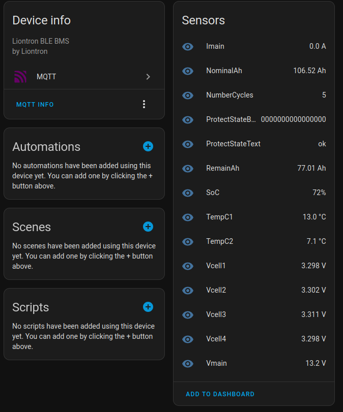

# Liontron BLE BMS → MQTT to Home Assistant
Read Liontron Smart BMS battery data via BLE on a Raspberry Pi and push it to Home Assistant using MQTT Discovery.

---

## 📦 Project Overview

This tool communicates with Liontron LiFePO₄ batteries using Bluetooth Low Energy (BLE), reads voltage, current, SoC, and more — and publishes them to MQTT in a Home Assistant-friendly format.

It includes:
- 🧠 MQTT auto-discovery for each battery parameter
- 🔄 Reliable device availability via MQTT LWT
- ✅ Multiple battery support
- 🪫 Automatic Home Assistant updates on reboot or crash




---

## 📚 Credits

> ⚠️ **Huge thanks** to the original project and library author:  
> [AxdeExpe/Liontron-BMS-BLE-Reader-Raspberry-Pi](https://github.com/AxdeExpe/Liontron-BMS-BLE-Reader-Raspberry-Pi)  
> This project builds on their great work to integrate with MQTT and Home Assistant.

---

## 🛠 Requirements

Tested on: **Raspberry Pi OS Bullseye (Lite/Desktop)**

### ✅ Install required packages

```bash
sudo apt update
sudo apt install -y python3 python3-pip python3-pexpect bluetooth bluez
```

### ✅ Install required Python libraries

```bash
pip3 install paho-mqtt pyyaml
```

---

## 📶 Enable & Test Bluetooth

### 🔧 Enable Bluetooth (if disabled)

For newer Pi OS releases, Bluetooth may be disabled by default.

#### Check status:
```bash
sudo systemctl status bluetooth
```

#### Enable and start:
```bash
sudo systemctl enable bluetooth
sudo systemctl start bluetooth
```

#### Use `bluetoothctl`:
```bash
bluetoothctl
[bluetooth]# power on
[bluetooth]# agent on
[bluetooth]# scan on
```
use "exit" for exiting

### 🔍 Scan for BLE MAC addresses

```bash
sudo hcitool -i hci0 lescan
```

Wait a few seconds for battery MACs to show up (e.g., `A4:C1:AA:BB:CC:DD`).

---

## ⚙️ Configuration

Copy and edit the sample config:

```bash
cp config.yaml_sample config.yaml
nano config.yaml
```

### `config.yaml_sample`

```yaml
log_level: "DEBUG"

mqtt:
  host: "localhost"
  port: 1883
  username: "mqtt_user"
  password: "mqtt_pass"
  base_topic: "liontron"

vendor: "liontron"

batteries:
  - "A4:C1:AA:BB:CC:DD"
  - "XX:YY:ZZ:11:22:33"

update_interval: 60
```

---

## 🚀 Running the script manually

```bash
python3 mqtt_liontron_publisher.py config.yaml
```

Use `journalctl` or logs in `/var/log/syslog` to monitor output when running under systemd.

---

## ⚙️ Autostart via systemd

### 1. Create service file

```bash
sudo nano /etc/systemd/system/liontron-mqtt.service
```

Paste:

```ini
[Unit]
Description=Liontron BMS to MQTT Publisher
After=network.target bluetooth.service

[Service]
ExecStart=/usr/bin/python3 /opt/liontron_mqtt/mqtt_liontron_publisher.py /etc/liontron_mqtt.yaml
WorkingDirectory=/tmp
StandardOutput=journal
StandardError=journal
Restart=always
User=nobody

[Install]
WantedBy=multi-user.target
```

> 🔁 Adjust paths to your setup (`/home/pi/`, etc.).

### 2. Enable + start the service

```bash
sudo systemctl daemon-reexec
sudo systemctl enable liontron-mqtt.service
sudo systemctl start liontron-mqtt.service
```

### 3. Check logs

```bash
journalctl -u liontron-mqtt.service -f
```

---

## 🧪 Home Assistant Integration

This project uses MQTT Discovery.

Once the script runs and data is published:
- Go to **Settings → Devices & Services → MQTT**
- Click **"Configure"**
- You will see each battery and all its sensors auto-created!

If not, ensure:
- MQTT is working
- Discovery is enabled in HA (`mqtt: discovery: true`)
- The topic `liontron/status` shows `"online"` in `MQTT Explorer` or similar tool

---

## ✅ Summary

| Feature                | ✅ Status |
|------------------------|----------|
| BLE Support            | ✔️        |
| Multiple Batteries     | ✔️        |
| MQTT Discovery         | ✔️        |
| Auto Recovery (LWT)    | ✔️        |
| systemd Integration    | ✔️        |

---


Happy automating! ☀️🔋📡
